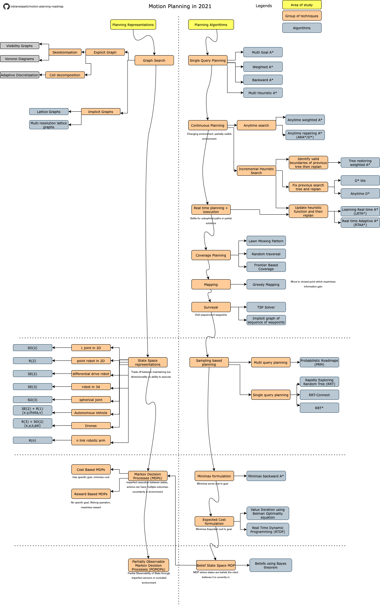

# motion-planning-roadmap
Roadmap of areas of study in motion planning

### Credits
This roadmap is based on 16-782 Planning and Decision Making in robotics offered by Prof. Maxim Likhachev at CMU https://www.cs.cmu.edu/~maxim/classes/robotplanning_grad/

### Notes
* Admissibility of a Heuristic : Guaranteed to not overestimate to cost of least cost path from any state to the goal
* Backward search : is more benefitial if you know that the goal is stationary but robot is moving so costs can be reused for replanning if needed
* Free space assumption : Whatever you dont know assume it as free space to ensure completeness
* f value of state = total cost to reach the goal through the state ( g value +h value)
* h value is cost to goal of that state decided by the heuristic function 
* g value is cost to reach that state from the start position
* undirected graph -> actions are reversible
* Avoid collision checking by comparing distance to obstacles with radius of inner and outer circles
* Graph search : deterministic completeness based on discretisation
* Sampling based planning : probabilistic completeness based on number of samples 
* Connecting two trees in RRT connect can be quite tricky for kinodynamic planning 
* Usual trade offs in planning completeness vs optimality vs computation vs running time
* Weights in a cost function for computing edge costs can be learned using imitation learning
* Metric Space : The distance function of the space follows the generalised euclidean metric
* Markov property: Cost of transition and set of successor states in the graph only depends on the current state (not on the history)
* If dependent variables break the markov property it may or may not introduce incompleteness
* Dominance relation : if g(s) < g(s') and s dominates s' then s' can be pruned from search

### Roadmap

